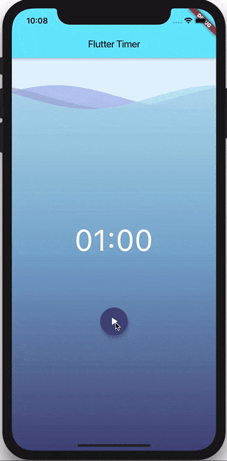

# flutter_timer

how to build a timer application using the bloc library. The finished application should look like this:

Key Topics
    Observe state changes with BlocObserver.
    BlocProvider, Flutter widget which provides a bloc to its children.
    BlocBuilder, Flutter widget that handles building the widget in response to new states.
    Prevent unnecessary rebuilds with Equatable.
    Learn to use StreamSubscription in a Bloc.
    Prevent unnecessary rebuilds with buildWhen.